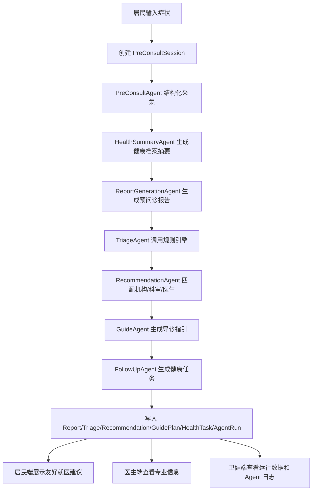
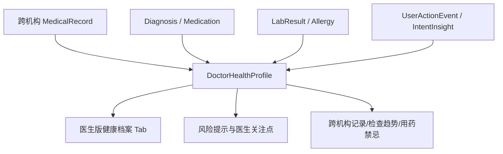
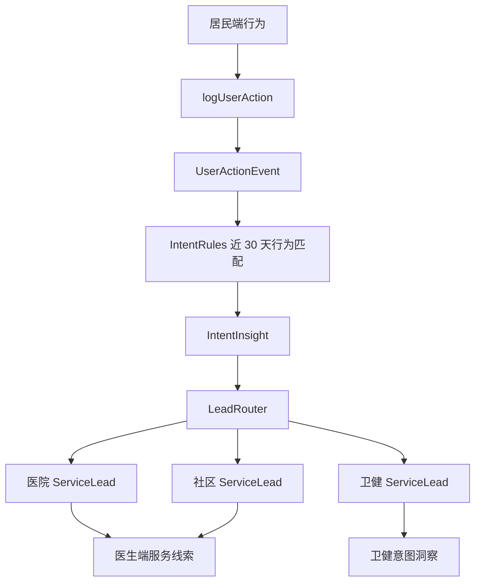

# 高新区全民健康档案与智能导诊平台：实际产品设计说明

## 1. 文档定位

本文档基于当前代码库实际实现编写，用于指导后续产品迭代、模块拆分、演示部署和真实接口接入。它不是理想化 PRD，而是当前系统的“可运行产品说明 + 模块边界说明 + 下一步迭代地图”。

当前代码已移除旧 `/app` 原型居民端。后续居民端只维护 `/gaoxin`，医生端 `/doctor` 和卫健管理端 `/admin` 保持为专业工作台和治理后台。

## 2. 当前产品一句话

面向成都市高新区卫健委，系统模拟“健康高新”小程序接入 AI 健康能力后的完整闭环：居民在融合版小程序端发起智能预问诊和健康管理，医生端获得诊前摘要、医生版健康档案和服务线索，卫健端查看运行数据、Agent 日志、居民意图洞察和区域服务治理信息。

## 3. 当前非目标

当前版本仍是 MVP 演示系统，明确不承担以下生产能力：

- 不做真实微信小程序发布。
- 不接真实身份认证、医保、挂号、支付。
- 不接真实 HIS、EMR、LIS、PACS、省卫健接口。
- 不做真实医学影像识别、语音识别。
- 不接真实大模型，当前只使用 Mock AI Provider。
- 不提供真实诊断、治疗方案或医疗合规闭环。
- 居民端不展示内部 P0-P4、推荐分、Agent 原始输出等专业字段。

## 4. 三端产品结构

| 端 | 路由 | 用户 | 当前定位 |
| --- | --- | --- | --- |
| 项目入口 | `/` | 演示人员 | 进入融合版居民端、医生端、卫健端，并提供四个演示场景入口 |
| 高新健康融合版居民端 | `/gaoxin` | 居民 | 模拟现有“健康高新”小程序接入小高健康助手后的最终产品形态 |
| 医生端 | `/doctor` | 医院医生、社区医生、导诊人员 | 查看患者诊前信息、医生版健康档案、风险关注点、行为意图和服务线索 |
| 卫健管理端 | `/admin` | 卫健委管理人员 | 管理资源、规则、知识库，查看运行驾驶舱、Agent 日志、质量反馈和意图洞察 |

## 5. 关键体验边界

### 5.1 居民端展示策略

居民端只表达“就医建议”和“导诊指引”，不表达内部风险和算法细节。

| 后端内部字段 | 居民端展示方式 | 医生/卫健端展示方式 |
| --- | --- | --- |
| `TriageResult.level` | 映射为“建议立即线下就医 / 建议专科门诊评估 / 建议社区或家庭医生服务”等 | 可直接展示 P0-P4 |
| `Recommendation.score` | 不展示数值，只展示“优先推荐、专科专家、社区承接、连续管理”等标签 | 可展示推荐分和命中原因 |
| `AgentRun.inputJson/outputJson` | 不展示 | 卫健端 Agent 日志展示 |
| `RiskFocusItem` | 不展示专业风险分类 | 医生端按分类展示 |
| `ServiceLead.receiverType` | 转为“已生成就医建议 / 社区随访建议 / 健康管理提醒” | 医生端和卫健端展示分派对象、状态和优先级 |

居民端展示映射主要在：

- `src/lib/gaoxin/display-mappers.ts`
- `src/lib/gaoxin/recommendation-path.ts`
- `src/components/gaoxin/gaoxin-recommendation-card.tsx`
- `src/components/gaoxin/gaoxin-guide-card.tsx`

### 5.2 专业端展示策略

医生端和卫健端可以展示内部专业信息：

- P0-P4 分诊等级
- 推荐分、推荐原因
- AgentRun 输入输出
- 风险提示与医生关注点
- 用户行为证据
- 意图洞察、服务线索、处理状态

## 6. 当前能力地图

### 6.1 居民端 `/gaoxin`

| 页面 | 路由 | 当前能力 |
| --- | --- | --- |
| 首页 | `/gaoxin` | 服务大厅、电子健康卡、小高健康助手、AI 健康服务入口、健康头条 |
| AI 健康 | `/gaoxin/ai` | 问候区、健康摘要、快捷能力、推荐问题、底部输入框、关键词路由 |
| 我的 | `/gaoxin/mine` | 当前成员、电子健康卡、我的记录、我的健康数据、常用工具 |
| 智能预问诊 | `/gaoxin/pre-consult` | 四个演示场景、文本输入、图片/语音占位、调用完整 Agent 链路 |
| 结果页 | `/gaoxin/pre-consult/[id]/result` | 就医建议、预问诊摘要、健康档案摘要、推荐机构和导诊入口 |
| 导诊指引 | `/gaoxin/guide/[id]` | 推荐就诊信息、步骤、准备事项、导航说明、健康档案和健康任务入口 |
| 全民健康档案 | `/gaoxin/health-record` | 数据来源概览、跨机构记录、健康摘要、用药/过敏/检查检验、档案用途 |
| 医疗资源 | `/gaoxin/resources` | 医院、社区卫生服务中心、医生资源，支持筛选和详情 |
| 报告解读 | `/gaoxin/report-ai` | Mock 报告选择、上传占位、解读结果、下一步建议 |
| 健康管理 | `/gaoxin/health-management` | 血压、血糖、复诊、随访、社区承接建议 |
| 我的记录 | `/gaoxin/records` | 挂号、缴费、报告、AI 问诊、导诊、随访、健康任务和友好线索记录 |

### 6.2 医生端 `/doctor`

| 页面 | 路由 | 当前能力 |
| --- | --- | --- |
| 工作台 | `/doctor` | 患者列表、主诉、推荐科室、医生版档案状态、健康问题标签、服务意图标签、待处理线索 |
| 患者详情 | `/doctor/patients/[id]` | 医生版健康档案、风险关注点、预问诊报告、跨机构记录、检查趋势、用药禁忌、行为意图、推荐理由、医生反馈 |
| 今日接诊 | `/doctor/schedule` | 复用推荐患者和接诊状态展示 |
| 服务线索 | `/doctor/service-leads` | 医院线索、社区线索、慢病随访、用药安全等线索筛选和状态操作 |

医生端核心价值是把零散患者记录整理成诊前可读的专业视图，而不是重复居民端结果页。

### 6.3 卫健端 `/admin`

| 页面 | 路由 | 当前能力 |
| --- | --- | --- |
| 运行驾驶舱 | `/admin` | 预问诊数、健康档案数、推荐流向、分诊分布、反馈准确率、热门症状、Agent 错误 |
| 机构管理 | `/admin/institutions` | 医院和社区卫生服务中心列表、新增、编辑、科室/医生数量 |
| 科室管理 | `/admin/departments` | 科室列表、机构筛选、症状关键词、疾病关键词、新增/编辑 |
| 医生管理 | `/admin/doctors` | 医生列表、专家池筛选、新增/编辑、擅长方向 |
| 分诊规则 | `/admin/rules` | TriageRule 列表、新增、编辑、启停 |
| 知识库 | `/admin/knowledge` | KnowledgeDocument 列表、新增、编辑、标签和引用占位 |
| Agent 日志 | `/admin/agent-runs` | AgentRun 列表、筛选、详情 JSON |
| 质量反馈 | `/admin/quality` | AgentFeedback、QualityIssue、处理状态 |
| 模型配置 | `/admin/model-config` | 当前 Mock Provider、模型版本、Prompt 模板和未来扩展说明 |
| 意图洞察 | `/admin/intent-insights` | 用户行为、意图排行、线索流向、医院/社区/卫健线索、运营建议 |

## 7. 代码模块地图

### 7.1 页面层

| 路径 | 职责 |
| --- | --- |
| `src/app/page.tsx` | 系统总入口 |
| `src/app/gaoxin/` | 融合版居民端页面 |
| `src/app/doctor/` | 医生端页面 |
| `src/app/admin/` | 卫健管理端页面 |
| `src/app/api/` | Next.js Route Handlers |

### 7.2 UI 组件层

| 路径 | 职责 |
| --- | --- |
| `src/components/ui/` | shadcn/ui 基础组件 |
| `src/components/common/` | 通用后台壳层 |
| `src/components/gaoxin/` | 小程序风居民端组件和行为追踪组件 |
| `src/components/doctor/` | 医生工作台、患者详情、医生版健康档案、线索面板 |
| `src/components/admin/` | 卫健后台组件、图表、管理表格、意图洞察面板 |

组件边界约定：

- `gaoxin` 组件不引用 `doctor` 或 `admin` 组件。
- `doctor` 和 `admin` 可以展示内部字段。
- `ui` 目录只放基础组件，不放业务逻辑。
- 新增居民端展示策略优先放 `src/lib/gaoxin/`，不要散落在页面组件里。

### 7.3 领域服务层

| 路径 | 职责 |
| --- | --- |
| `src/lib/pre-consult/` | 预问诊会话创建、Agent 编排、结果读取 |
| `src/lib/ai/provider.ts` | AI Provider 抽象，目前实现为 MockAiProvider |
| `src/lib/ai/agents/` | 预问诊、健康摘要、报告、分诊、推荐、导诊、随访、质量 Agent |
| `src/lib/rules/` | 分诊规则加载、规则引擎和 fallback 规则 |
| `src/lib/matching/` | 推荐分计算、资源匹配和推荐理由 |
| `src/lib/recommendation/` | 推荐算法领域入口，包装 matching 实现 |
| `src/lib/health-record/` | 健康档案居民端展示适配入口 |
| `src/lib/resource/` | 医疗资源展示适配入口 |
| `src/lib/intent/` | 用户行为记录、意图规则、意图引擎、线索路由、中文映射 |
| `src/lib/admin/` | 卫健驾驶舱指标构造 |
| `src/lib/db/prisma.ts` | Prisma Client 单例 |
| `src/lib/api/response.ts` | API 响应封装 |

### 7.4 服务端查询与写入层

| 路径 | 职责 |
| --- | --- |
| `src/server/queries/resident-query.ts` | 默认居民和居民健康摘要 |
| `src/server/queries/resource-query.ts` | 医疗机构、科室、医生查询 |
| `src/server/queries/doctor-query.ts` | 医生工作台、患者详情、医生版健康档案、服务线索 |
| `src/server/queries/admin-query.ts` | 卫健驾驶舱、意图洞察、服务线索 |
| `src/server/mutations/feedback-mutation.ts` | 医生反馈与质量问题写入 |
| `src/server/mutations/service-lead-mutation.ts` | 服务线索状态和反馈写入 |

后续新增复杂页面时，优先新增或复用 `src/server/queries/*`，避免页面层直接拼复杂 Prisma include。

## 8. 数据模型分域

Prisma Schema 位于 `prisma/schema.prisma`，当前使用 SQLite，JSON 类字段多以 `String` 保存 JSON 文本，通过 `src/lib/json.ts`、`src/lib/json-utils.ts` 做兼容解析。

### 8.1 用户与角色

- `User`
- `ResidentProfile`
- `DoctorProfile`
- `AdminProfile`

当前只是 Mock 角色入口，不做真实登录。`ResidentProfile` 已扩展 `caseKey`、`caseSummary`、`primaryScenario`，用于演示病例库。

### 8.2 居民健康档案

- `HealthTag`
- `MedicalRecord`
- `Diagnosis`
- `Medication`
- `LabResult`
- `Allergy`
- `HealthSummary`
- `HealthTask`
- `DoctorHealthProfile`
- `RiskFocusItem`

设计含义：

- `MedicalRecord` 表达跨机构零散就诊、体检、社区随访等原始记录。
- `HealthSummary` 是居民端和普通摘要的来源。
- `DoctorHealthProfile` 是医生端的一页式专业健康档案。
- `RiskFocusItem` 是医生关注点，按急性风险、慢病控制、用药安全、检查趋势、数据质量等分类。

### 8.3 医疗资源

- `Institution`
- `Department`
- `Doctor`
- `ExpertPool`
- `ServiceCapability`

资源匹配依赖：

- 机构类型：三甲医院或社区卫生服务中心。
- 科室关键词：症状关键词、疾病关键词。
- 医生能力：专家池、职称、擅长方向。
- 服务能力：慢病管理、儿童保健、老年健康、康复随访、中医适宜技术等。

### 8.4 预问诊、分诊、推荐、导诊

- `PreConsultSession`
- `PreConsultMessage`
- `PreConsultReport`
- `TriageResult`
- `Recommendation`
- `GuidePlan`

这是核心演示闭环。后续接真实挂号时，不建议直接把挂号状态塞进 `Recommendation`，应新增 `AppointmentIntent` 或 `AppointmentRecord`，从 `GuidePlan` 或 `Recommendation` 关联。

### 8.5 规则、知识库、模型配置

- `TriageRule`
- `DepartmentMappingRule`
- `MatchingRule`
- `KnowledgeDocument`
- `KnowledgeChunk`
- `PromptTemplate`
- `ModelVersion`

当前用于 Mock 管理和演示。后续接真实 RAG 时，`KnowledgeDocument` 和 `KnowledgeChunk` 可迁移到向量库或增加 embedding 字段。

### 8.6 Agent、反馈与质量

- `AgentRun`
- `AgentStep`
- `AgentFeedback`
- `QualityIssue`

每次预问诊链路会写多个 `AgentRun`。医生反馈写入 `AgentFeedback`，不准确或低评分反馈可形成 `QualityIssue`，供卫健端治理。

### 8.7 行为、意图与服务线索

- `UserActionEvent`
- `IntentInsight`
- `ServiceLead`
- `LeadFeedback`

运营增强包依赖这组模型：

1. 居民端关键动作写 `UserActionEvent`。
2. `analyzeResidentIntent(residentId)` 读取近 30 天行为。
3. `intent-rules.ts` 匹配胸痛、高血压复诊、报告解读、家医签约、儿童健康、用药安全等意图。
4. `lead-router.ts` 分派到医院、社区卫生服务中心或卫健端。
5. 医生端和卫健端处理 `ServiceLead` 并写 `LeadFeedback`。

## 9. 核心业务流程

### 9.1 智能预问诊链路

主入口：`src/lib/pre-consult/session-service.ts`



关键约束：

- Agent 当前全部是 Mock 确定性输出，保证演示稳定。
- `TriageResult.level` 和 `Recommendation.score` 保留给专业端使用。
- 居民端结果页必须经过展示映射，不直接暴露内部等级和分值。

### 9.2 医生版健康档案链路



医生端的产品重点：

- 让医生快速知道“这个人为什么被推荐来”。
- 让医生看到跨机构记录来源，而不是只看本次输入。
- 让医生核实关键风险点和数据质量问题。

### 9.3 用户行为到服务线索链路

主入口：`src/lib/intent/intent-engine.ts`



行为采集入口：

- `src/lib/intent/action-logger.ts`
- `src/lib/intent/client-action.ts`
- `src/components/gaoxin/gaoxin-action-tracker.tsx`
- `src/components/gaoxin/gaoxin-tracked-link.tsx`
- `/api/intent/actions`

当前意图识别是规则 + Mock LLM 摘要，不是真实用户画像系统。文案应保持“初步建议”和“服务承接”口径。

## 10. API 设计现状

API 使用 Next.js Route Handlers，集中在 `src/app/api/`。

| API 分组 | 主要职责 |
| --- | --- |
| `/api/pre-consult/*` | 创建 session、写消息、运行链路、取结果 |
| `/api/residents/*` | 默认居民、健康摘要 |
| `/api/resources/*` | 医疗机构和医生资源 |
| `/api/guide-plans/*` | 导诊详情 |
| `/api/doctor/*` | 工作台、患者详情、医生版健康档案、反馈、医生侧服务线索 |
| `/api/admin/*` | 驾驶舱、资源 CRUD、规则、知识库、日志、质量、意图洞察、服务线索 |
| `/api/intent/*` | 行为写入、意图分析、居民行为和线索查询 |
| `/api/health` | ECS/Docker 健康检查 |

响应封装：

- `src/lib/api/response.ts`
- 成功一般返回 `{ data: ... }`
- 失败一般返回 `{ error: { code, message } }`

后续约束：

- 新增写接口必须补 zod 输入校验。
- API 返回结构要向后兼容，尤其 `/gaoxin`、`/doctor`、`/admin` 已经依赖的字段。
- 复杂查询优先在 `src/server/queries/*` 聚合，不要在页面和 API 中重复 include。

## 11. Seed 与演示数据

Seed 入口：`prisma/seed.ts`

Seed 模块：

| 文件 | 职责 |
| --- | --- |
| `prisma/seed/reset.ts` | 清理演示数据库，保证 seed 可重复执行 |
| `prisma/seed/institutions.ts` | 三甲医院和社区卫生服务中心 |
| `prisma/seed/departments.ts` | 科室和服务能力 |
| `prisma/seed/doctors.ts` | 医生和专家池 |
| `prisma/seed/residents.ts` | 4 个基础演示居民 |
| `prisma/seed/operational-demo.ts` | 12 个运营增强患者、医生版档案、行为、意图、线索 |
| `prisma/seed/rules-knowledge.ts` | 规则、知识库、Prompt、模型版本 |
| `prisma/seed/pre-consult-demo.ts` | 预问诊演示 session、推荐、导诊、AgentRun |

当前病例库：

- 基础四例：张建国、李秀兰、王小宝、陈明。
- 运营增强十二例：赵德全、刘桂芳、周敏、黄俊、杨帆、吴强、郑梅、孙磊、唐蓉、罗成、蒋丽、何伟。

演示数据目标：

- 证明零散记录可以整理成居民端健康档案和医生端健康档案。
- 证明用户行为可以形成医院、社区、卫健三类服务线索。
- 证明医生端和卫健端可以围绕线索进行服务承接和治理。

## 12. 验收脚本

| 命令 | 作用 |
| --- | --- |
| `pnpm smoke` | 基础预问诊 smoke test |
| `pnpm final-check` | 初版闭环检查 |
| `pnpm gaoxin-check` | 融合版四个场景闭环检查 |
| `pnpm patient-demo-check` | 16 个患者案例数据量和重点患者检查 |
| `pnpm intent-demo-check` | 张建国、李秀兰行为意图和线索生成检查 |
| `pnpm operational-demo-check` | 运营演示增强包总检查 |
| `pnpm lint` | ESLint 检查 |
| `pnpm typecheck` | TypeScript 检查 |
| `pnpm build` | Next.js 生产构建 |

推荐演示前执行：

```bash
pnpm db:seed
pnpm gaoxin-check
pnpm patient-demo-check
pnpm intent-demo-check
pnpm operational-demo-check
pnpm typecheck
pnpm build
```

## 13. 部署现状

部署文档：`docs/deployment-ecs.md`

当前为国内 ECS 演示部署做了以下准备：

- `Dockerfile`
- `docker-compose.ecs.yml`
- `.env.example`
- `.env.production.example`
- `deploy/scripts/ecs-entrypoint.sh`
- `deploy/nginx/gaoxin-health.conf.example`
- `deploy/systemd/gaoxin-health.service.example`
- `/api/health`

当前 ECS 演示仍使用 SQLite。生产化或长期公网演示建议迁移到云数据库，并补充 HTTPS、备份、日志脱敏、权限隔离和访问控制。

## 14. 当前维护风险

1. **SQLite + Mock 数据适合演示，不适合多人真实并发。**
2. **JSON 字段多为 String JSON，后续复杂查询会吃力。**
3. **部分 API 写入缺少统一 zod 校验。**
4. **部分页面仍有直接 Prisma 查询，后续应继续收敛到 server query。**
5. **Agent 是 Mock 规则输出，不能代表真实模型能力。**
6. **居民端、医生端、卫健端共用同一数据库对象，未来接认证后要补权限边界。**
7. **行为事件用于演示意图识别，不应被包装为生产级用户画像或隐私监控。**
8. **医疗合规、人审、审计、兜底流程尚未实现。**

## 15. 后续迭代建议

### P0：稳定演示主线

目标：保证演示不翻车。

- 保持 `/gaoxin` 为唯一居民端。
- 所有居民端新增能力必须遵守“隐藏内部等级和分值”原则。
- 每次演示前运行 `db:seed`、`gaoxin-check`、`operational-demo-check`、`build`。
- 修复 lint script 中 `next lint` 的兼容问题，可改为直接 `eslint .`。

### P1：产品结构收敛

目标：减少后续改动成本。

- 将页面中直接 Prisma 查询继续迁移到 `src/server/queries/*`。
- API 写入接口增加 zod schema。
- 把医生端患者详情中的重复展示类型沉到 `src/types` 或 `src/lib/doctor`。
- 将 `src/lib/gaoxin` 中 Mock 和展示适配分开：`adapters/`、`mocks/`、`display/`。

### P2：真实接口预留

目标：为接入真实系统做接口边界。

- 新增外部数据接入层：`src/lib/integrations/`。
- 为 HIS/EMR/LIS/PACS、省卫健平台定义 DTO 和同步状态。
- 将 `MedicalRecord` 等 Mock 数据来源增加 `externalSourceId`、`syncStatus`、`sourceSystem` 等字段。
- 将 `KnowledgeDocument/KnowledgeChunk` 准备迁移到向量知识库。

### P3：运营与服务闭环

目标：让意图洞察从演示走向可运营。

- 增加线索分派规则配置页。
- 增加线索处理 SLA、责任机构、处理记录和统计报表。
- 增加居民端对线索处理结果的友好反馈。
- 增加医院、社区、卫健三类视角的数据权限。

### P4：生产化安全与合规

目标：从演示系统变成可试点系统。

- 真实身份认证和角色权限。
- 审计日志、数据脱敏、访问控制。
- HTTPS、WAF、备份、监控、告警。
- 医疗专家审核流程。
- 模型输出安全策略、人工兜底和质量评估。

## 16. 新功能落地规则

### 新增居民端能力

1. 页面放 `src/app/gaoxin/`。
2. 组件放 `src/components/gaoxin/`。
3. 展示映射放 `src/lib/gaoxin/`。
4. 数据读取优先走 API 或 server query。
5. 不展示 P0-P4、推荐分、Agent 原始 JSON。

### 新增医生端能力

1. 页面放 `src/app/doctor/`。
2. 组件放 `src/components/doctor/`。
3. 查询聚合优先放 `src/server/queries/doctor-query.ts` 或新领域 query。
4. 可以展示内部专业字段，但要解释证据来源。

### 新增卫健端能力

1. 页面放 `src/app/admin/`。
2. 组件放 `src/components/admin/`。
3. 聚合指标优先放 `src/server/queries/admin-query.ts` 或 `src/lib/admin/`。
4. 文案强调区域健康服务治理，不写“监控用户隐私”类表达。

### 新增 Agent

1. 文件放 `src/lib/ai/agents/`。
2. 类型放 `src/lib/ai/agents/types.ts`。
3. 调用后必须写 `AgentRun`。
4. 如果在预问诊链路，接入 `runPreConsultSession`。
5. 如果在运营链路，接入 `src/lib/intent/` 或新增独立领域服务。

### 新增服务线索类型

1. Prisma enum 增加 `IntentType` 或 `LeadType`。
2. `src/lib/intent/intent-display.ts` 增加中文映射。
3. `src/lib/intent/intent-rules.ts` 增加识别规则。
4. `src/lib/intent/lead-router.ts` 增加分派策略。
5. 医生端和卫健端补展示。
6. Seed 和 `intent-demo-check` 增加样例。

## 17. 当前建议的下一步

如果下一轮要继续迭代，建议优先做以下方向之一：

1. **演示稳定性**：修复 lint script、补 API zod 校验、补关键页面空状态。
2. **产品体验**：继续打磨 `/gaoxin` 首页、AI 健康页和健康档案页，让它更像真实小程序。
3. **医生端价值**：把医生版健康档案做成更强的一页式摘要，增加“打印/分享给医生”演示。
4. **运营治理**：把意图洞察页做成可筛选、可导出、可查看详情的运营看板。
5. **公网演示**：按 ECS 文档部署，补 HTTPS、域名、基础访问保护和演示数据重置策略。
